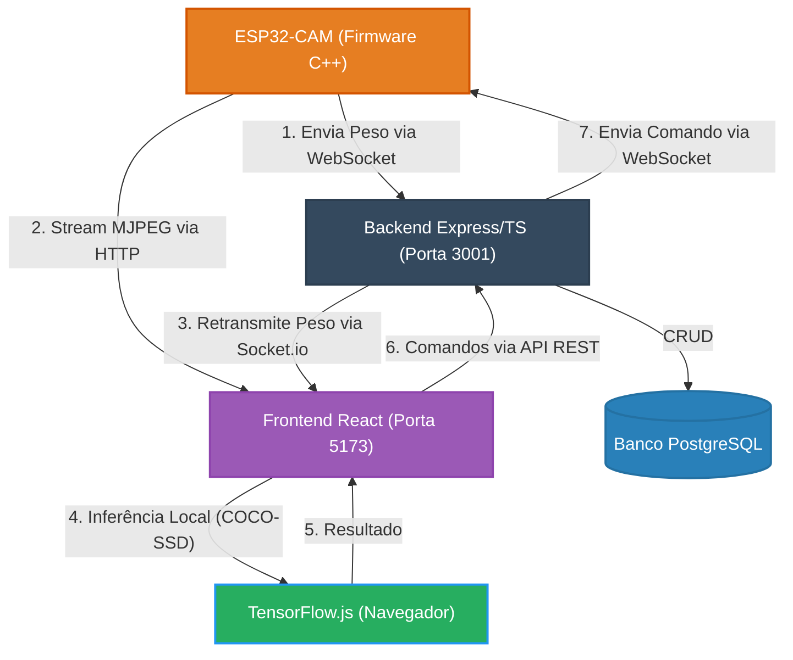

# Pet Feeder 🐱

Este repositório contém a estrutura de um sistema inteligente para reconhecimento de pets utilizando visão computacional diretamente no navegador e Internet das Coisas (IoT). O ecossistema é composto por firmware para **ESP32-CAM**, comunicação em tempo real via **WebSockets**, um **Backend Node.js/Express**, e um **Frontend React/Vite** capaz de realizar inferência local de inteligência artificial através do **TensorFlow.js**.

## 👥 Integrantes do Grupo

- Andre
- Athila
- Bernardo Vargens Broedel
- Stefanio

---

## 🏗️ Arquitetura do Sistema

O fluxo de comunicação e processamento funciona da seguinte forma:



### 🧠 Como Funciona o Reconhecimento?

A execução do modelo de Inteligência Artificial ocorre **diretamente no navegador do usuário** (Client-side / Edge AI):

1. **Captura:** A câmera do ESP32-CAM disponibiliza um endpoint HTTP de stream MJPEG (`/stream`) na rede local.
2. **Exibição Direta:** O Frontend acessa o stream diretamente pelo IP da ESP32 na rede local (sem passar pelo Backend). O Backend apenas informa ao Frontend qual é o IP da ESP32 conectada.
3. **Detecção Local:** A interface React processa os frames do stream utilizando **TensorFlow.js** com o modelo **COCO-SSD**, rodando a inferência a cada 5 segundos no próprio navegador do usuário para detectar a presença de um gato.
4. **Notificação:** Se um gato for detectado, o sistema exibe um popup visual na interface e toca um som de notificação via Web Audio API.

---

## 🌟 Funcionalidades do Sistema

O **software (Backend e Frontend)** atua como painel de controle e monitoramento do projeto:

- **Câmera ao Vivo com IA**: Stream MJPEG em tempo real direto da ESP32-CAM, com detecção de gatos via TensorFlow.js / COCO-SSD rodando no navegador. Ao detectar um gato, exibe uma notificação visual e sonora.
- **Monitoramento de Peso em Tempo Real**: Leitura contínua da célula de carga (HX711) exibida na página de Sensores, com atualização via WebSocket.
- **Controle Operacional do Motor**: Painel completo para ligar/desligar o motor de passo, inverter direção, ajustar velocidade (RPM), ativar estratégia anti-obstrução e controlar o delay do loop — tudo via interface web.
- **Cadastro de Agendamentos**: Interface para criar, editar, ativar/desativar e remover horários de alimentação, com dados persistidos no banco PostgreSQL.
- **Alimentação Manual**: Botão para liberar ração imediatamente com quantidade configurável em gramas.
- **Cadastro de Pets**: CRUD completo para registrar pets com nome, idade, peso e foto (avatar).
- **Dashboard**: Painel com status de conexão da ESP32, indicador de próxima refeição agendada e gráfico de consumo semanal

---

## 📂 Estrutura do Repositório

```
pic-2-pet-feeder/
├── hardware/                    # Código embarcado (firmware)
│   ├── esp32-cam-full-code.ino  # Firmware da ESP32-CAM (C++ / Arduino)
│   └── README.md                # Instruções de setup, bibliotecas e pinagem
│
├── software/                    # Toda a stack de software
│   ├── README.md                # Instruções detalhadas, endpoints e tech stack
│   ├── docker-compose.yml       # PostgreSQL + PGAdmin
│   ├── back/                    # API Backend (Node.js + Express + Drizzle)
│   │   ├── src/
│   │   ├── drizzle/
│   │   ├── package.json
│   │   └── .env
│   └── front/                   # Painel Frontend (React + Vite + TailwindCSS)
│       ├── src/
│       ├── public/
│       └── package.json
│
├── .gitignore
└── README.md
```

---

## ⚙️ Componentes de Hardware (Lista de Materiais)

Para a montagem física do Alimentador Inteligente, foram utilizados os seguintes componentes:

- **ESP32-CAM**: Microcontrolador principal responsável por capturar as imagens, processar os comandos e conectar ao Wi-Fi.
- **Motor de Passo NEMA 17**: Responsável pelo giro do mecanismo interno (parafuso sem-fim / hélice) que libera a ração.
- **Módulo Ponte H L298N**: Driver de potência utilizado para acionar as bobinas e controlar o motor de passo.
- **Célula de Carga (Strain Gauge) 1kg**: Sensor de peso posicionado no prato para medir a quantidade de ração disponível.
- **Módulo Amplificador HX711**: Conversor analógico-digital de precisão, necessário para ler os minúsculos sinais elétricos da célula de carga e enviá-los ao ESP32.
- **Fonte de Alimentação 5V**: Fornece energia adequada e estável para suportar os picos de corrente da ESP32-CAM, dos módulos e do motor simultaneamente.
- **Maquete 3D do PetFeeder**: Estrutura mecânica impressa em 3D que abriga a eletrônica, o reservatório principal de ração e o prato do pet.

---

## 🚀 Como Instalar e Rodar

### Pré-requisitos

Certifique-se de ter as seguintes ferramentas instaladas na sua máquina:

| Ferramenta        | Versão mínima | Download                                                                 |
|-------------------|---------------|--------------------------------------------------------------------------|
| **Node.js**       | 18.x          | [nodejs.org](https://nodejs.org/)                                        |
| **npm**           | 9.x           | Incluso com o Node.js                                                    |
| **Docker Desktop**| —             | [docker.com](https://www.docker.com/products/docker-desktop/)            |
| **Arduino IDE**   | 2.x           | [arduino.cc](https://www.arduino.cc/en/software) *(apenas para o firmware)* |
| **Git**           | —             | [git-scm.com](https://git-scm.com/)                                     |

### 1. Clonar o repositório

```bash
git clone https://github.com/BernardoBroedel/pic-2-pet-feeder.git
cd pic-2-pet-feeder
```

---

### 2. Software (Docker + Backend + Frontend)

A stack de software inclui um banco PostgreSQL (Docker), API backend (Express/TypeScript) e painel frontend (React/Vite).

> 📖 **Instruções completas de instalação, endpoints da API, variáveis de ambiente e troubleshooting estão no [README do Software](./software/README.md).**

---

### 3. Firmware da ESP32-CAM (C++)

O código captura a imagem da câmera, faz as leituras da balança (HX711) e envia esses dados via WebSocket diretamente para o Backend. Também escuta comandos WebSocket para rotacionar o motor (liberar ração).

> 📖 **Instruções completas de configuração, bibliotecas necessárias, pinagem e upload estão no [README do Hardware](./hardware/README.md).**

---

### ▶️ Resumo Rápido — Subindo tudo

```bash
# Terminal 1 — Banco de dados
cd software
docker-compose up -d

# Terminal 2 — Backend
cd software/back
npm install
npm run db:generate   # apenas na primeira vez
npm run db:migrate    # apenas na primeira vez
npm run dev

# Terminal 3 — Frontend
cd software/front
npm install
npm run dev
```

Após tudo rodando, acesse **<http://localhost:5173>** no navegador.

---

## 🛠️ Tecnologias Utilizadas

- **Hardware / Firmware**: ESP32-CAM (C++ / Arduino IDE) com integração a balança (HX711) e motor de passo.
- **Comunicação**: WebSockets (`ws` + `WebSocketsClient` por Markus Sattler) e Socket.io.
- **Inteligência Artificial (Edge AI)**: TensorFlow.js / modelo COCO-SSD (rodando client-side).
- **Plataforma Web**:
  - **Frontend**: React, TypeScript, Vite, TailwindCSS.
  - **Backend**: Node.js, Express, TypeScript, Drizzle ORM.
  - **Banco de Dados**: PostgreSQL (Dockerizado).
